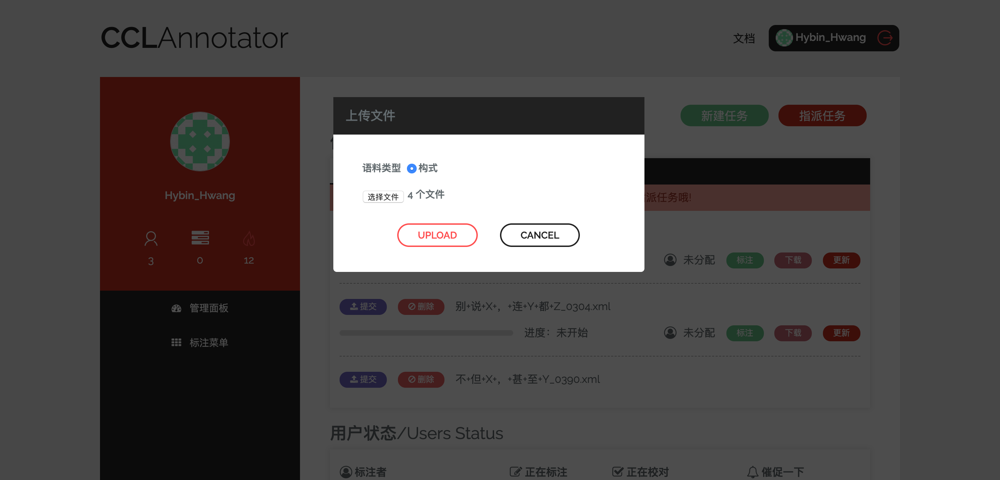
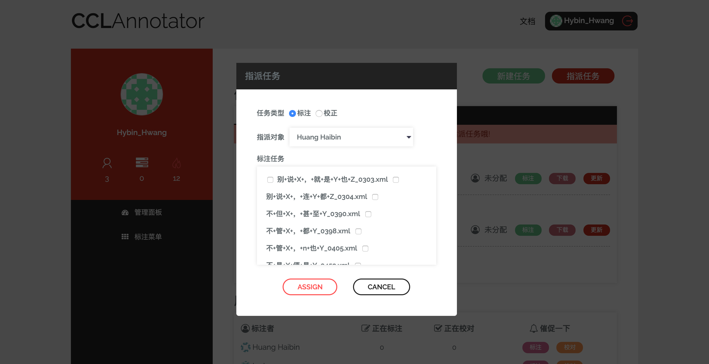
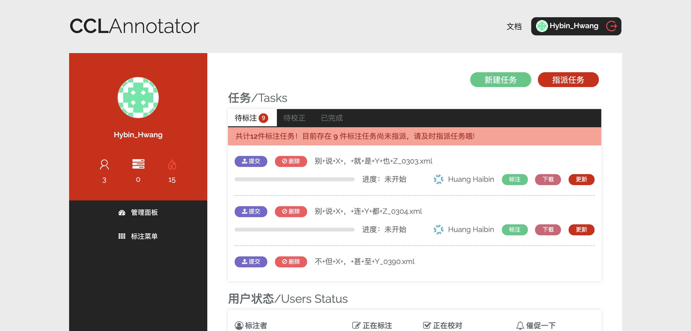
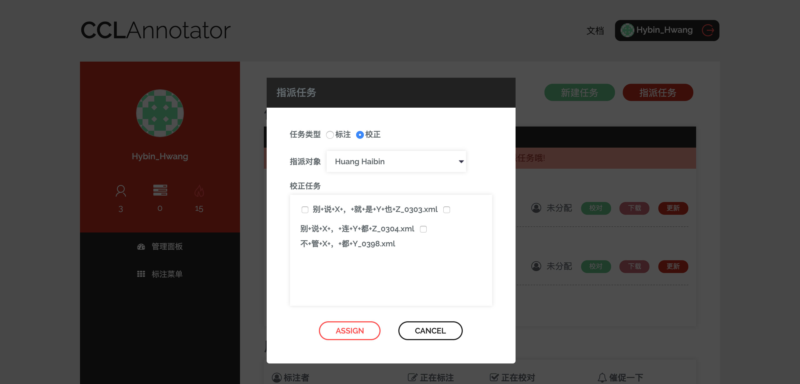
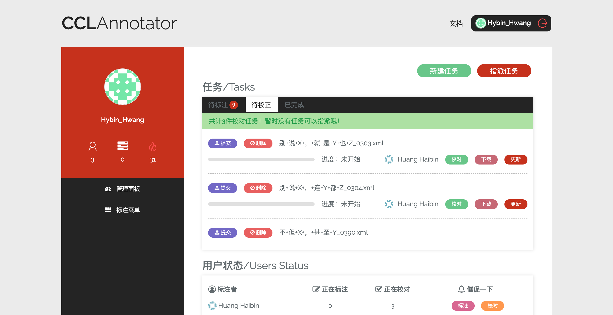
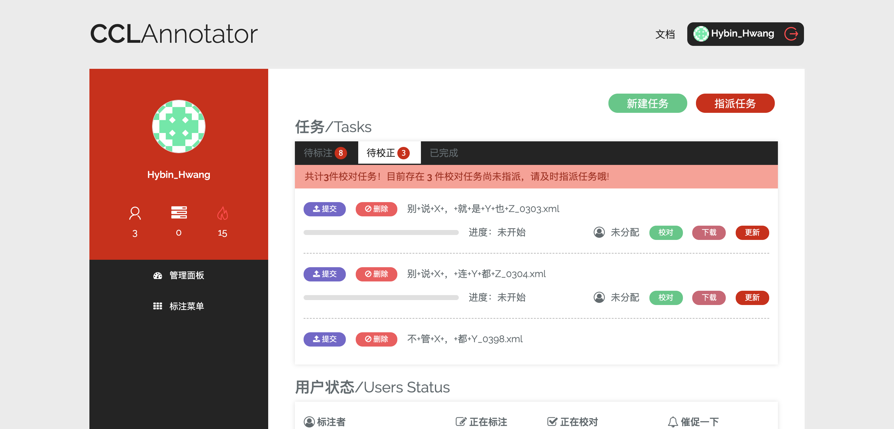
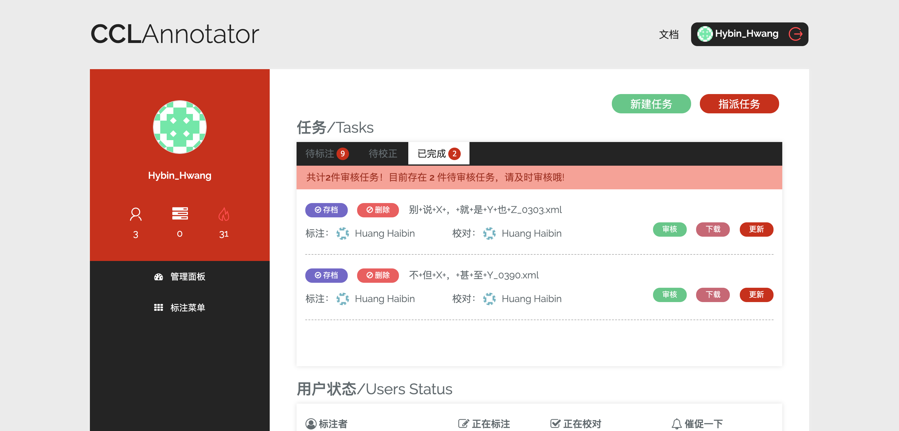
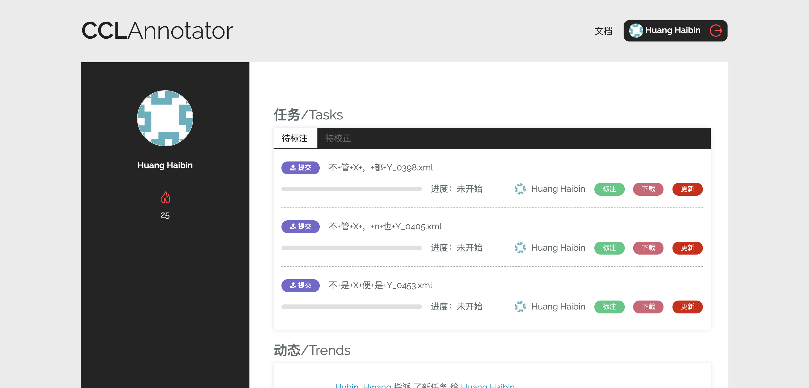
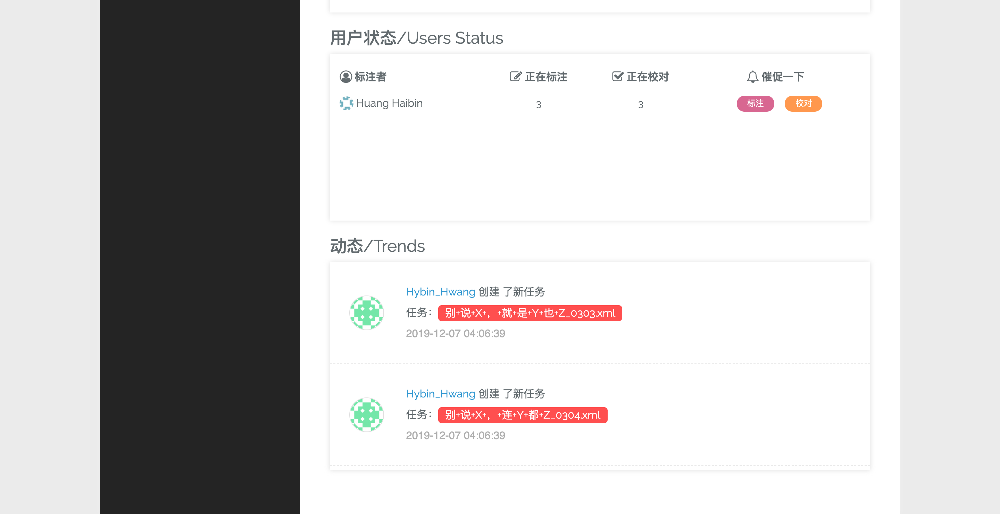
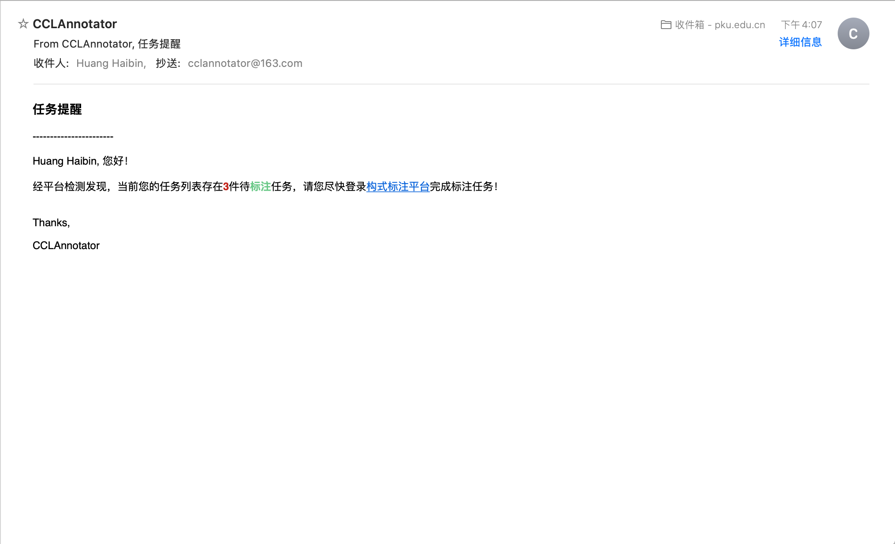

任务管理
==========================

标注任务周期描述
--------------------------

在 **CCLAnnotator** 构式语料标注平台上，任务管理的基本流程为：

平台管理篇
^^^^^^^^^^^^^^^^^^^^^^^^^^

平台管理员登录平台，可以选择点击右上角的 **新建任务** 上传构式语料，其支持批量上传：

构式语料文件上传到服务器之后，平台管理可以向标注人员指派标注任务——点击右上角的 **指派任务** 按钮，即可批量指派任务：

标注任务指派成功之后，任务列表中的相应任务会出现相应的标注人员：

同时，平台管理员具备最高权限，其可以选择 ``删除`` 、 ``更新`` 、 ``提交`` 文件：**删除** 文件不仅意味着任务取消，\
与之对应的构式语料文件也会被服务器删除；**更新** 文件则意味着平台管理员可以远程更新语料文件；**提交** 文件则表示平台\
管理员认定该任务可以进入下一阶段。

.. warning::
   ``删除`` 、 ``更新`` 、 ``提交`` 均属于不可撤回操作，平台管理员进行相应操作之前，应再三确认。

当标注人员完成语料标注，点击 **提交** 之后，相应的任务会进入下一阶段，即 **校对** 阶段。此时，平台管理员需要向标注\
人员指派校对任务——点击右上角的 **指派任务** 选择 ``校正`` ，即可批量指派校对任务：

校对任务指派成功之后，任务列表中的相应任务会出现相应的校对人员：

此外，需要注意的是，任务列表会实时显示 **已指派** 和 **未指派** 任务的数量：

同时，对于已完成校对的任务，平台管理员需要进行审核，审核通过之后，方可进行存档：

标注人员篇
^^^^^^^^^^^^^^^^^^^^^^^^^^

标注人员的标注和校对权限需平台管理员授权，而后被指派任务后，个人页面上将出现相应的任务列表：

标注人员可以点击 **标注** 或 **校对** 按钮开展标注或校对任务，此外，标注人员亦可以下载相应的语料文件进行线下标注，\
标注完成后，点击 **更新** 上传文件；之后，重新进入平台设计的标注区，点击 **SAVE** 即可更新标注/校对进度。

当标注人员认为自己已经完成标注/校对，则可以点击 **提交** 按钮，使任务进入下一阶段，并等待新的任务指派。

任务注意事项
--------------------------

离线标注
^^^^^^^^^^^^^^^^^^^^^^^^^^

.. note::
   平台对于语料文件有相对严格的要求，并为之设计了相应的 ``.xsd`` 文件作语法检查，点击 `此处 <http://ccl.pku.edu.cn:8088/CCLAnnotator/public/index.php/construction.xsd>`_ 下载，并将其置于\
   语料文件相同的文件夹下。

对于语料文件的基本结构，其描述如下示例：

.. code-block:: xml
   
   <document xmlns="http://ccl.pku.edu.cn" xmlns:xsi="http://www.w3.org/2001/XMLSchema-instance" xsi:schemaLocation="http://ccl.pku.edu.cn construction.xsd">
       <!-- ... -->
       <sentence annotated="1">text<cxn type=""><variable>text</variable><constant>text</constant></cxn>text</sentence>
       <!-- ... -->
   </document>

如上所示，一份语料文件包含 ``<document>`` 作为根节点，其子节点 ``<sentence>`` 表示一个句子，内部则又包含一个或多个 ``<cxn>`` 节点\
表示构式。节点 ``<cxn>`` 包含 ``<variable>`` 、 ``<constant>`` 、 ``<others>`` 节点，分别表示变项、常项和非构式成分。

另外，需要注意的是，节点 ``<sentence>`` 具备属性 ``annotated`` ，其取值为 ``0`` 或 ``1`` ；而节点 ``<cxn>`` 则具备 \
``type`` 这一基本的属性，其他属性由 ``type`` 决定。

任务催促
^^^^^^^^^^^^^^^^^^^^^^^^^^

假如平台管理员认为标注人员进度偏慢，可以通过催促功能发送邮件，对之进行催促：

收到催促的标注人员则会收到相应的催促邮件：

.. note::
   **CCLAnnotator** 构式语料标注平台使用的是163邮箱提供的免费SMTP服务，相对不稳定，偶尔会发生邮件发送失败的问题。